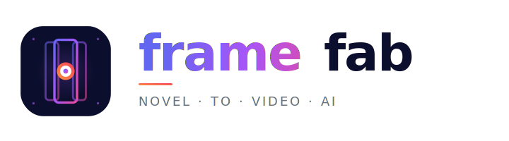

# 品牌设计指南 (Brand Guidelines)

> frame-fab 的视觉与品牌规范 —— Logo、色彩、字体、组件。所有贡献者请遵守。

---

## 1. 品牌识别

**frame-fab** 是一款 AI 漫剧创作平台，"frame"代表分镜/帧，"fab"代表 fabricate / 工厂。

- **中文名**：frame-fab · AI 漫剧创作平台
- **Slogan**：输入一本小说，AI 自动把它拍成一部漫剧——你只需要按「开始」
- **品牌定位**：专业、活力、未来感、创作者友好

---

## 2. Logo 规范

### 2.1 元素构成

Logo 由三部分组成：

1. **三帧胶片条带**（左右浅、中间深）—— 象征分镜与多镜头
2. **中心三圈光圈**（外橘-中白-内紫）—— 象征「启动」「开始」按钮
3. **顶角四装饰点**（紫色，60% 透明度）—— 增强精致感

### 2.2 Logo 变体

| 变体                  | 用途                      | 文件           |
| --------------------- | ------------------------- | -------------- |
| `logo.svg`            | 标准方形 logo             | 256×256 视图框 |
| `logo-horizontal.svg` | 文档页头/导航栏           | 720×200 视图框 |
| `favicon.svg`         | 浏览器标签/Tauri 桌面图标 | 64×64 视图框   |

### 2.3 Logo 使用规范

✅ **DO**：

- 在深色背景（#0B0E2C 或更深）上使用，logo 本身已含背景
- 保持 logo 周围至少 **32px** 安全空间
- 仅使用提供的官方 SVG，禁止自行重构

❌ **DON'T**：

- 不要在浅色/纯白背景上直接使用（logo 背景为深色）
- 不要拉伸/扭曲/旋转 logo
- 不要修改主色调
- 不要添加阴影、描边、滤镜
- 不要把 logo 文字与图标拆开使用

---

## 3. 色彩系统

### 3.1 品牌主色（Brand Primary）

| 名称           | 色值      | 用途                       |
| -------------- | --------- | -------------------------- |
| **Indigo-500** | `#6366F1` | 渐变起色、链接、强调       |
| **Purple-500** | `#A855F7` | 渐变中色、按钮 hover、聚焦 |
| **Pink-500**   | `#EC4899` | 渐变末色、CTA、关键操作    |
| **Orange-400** | `#FB923C` | 副色起点、警告辅助         |
| **Red-500**    | `#F43F5E` | 副色终点、错误、停止       |

### 3.2 渐变

```css
/* 主品牌渐变（最常用） */
.brand-primary {
  background: linear-gradient(135deg, #6366f1 0%, #a855f7 50%, #ec4899 100%);
}

/* 强调色渐变（中心圆环） */
.brand-accent {
  background: linear-gradient(45deg, #fb923c 0%, #f43f5e 100%);
}
```

### 3.3 中性色

| 名称          | 色值      | 用途              |
| ------------- | --------- | ----------------- |
| **Space-900** | `#0B0E2C` | 主背景、logo 底色 |
| **Gray-500**  | `#6B7280` | 副标题、说明文字  |
| **White**     | `#FFFFFF` | 前景、中心高亮    |
| **Gray-50**   | `#F9FAFB` | 浅色背景          |

### 3.4 主题适配

- **Dark Mode**（默认）：Space-900 背景 + 主色渐变文字
- **Light Mode**：白底 + 主色渐变文字（logo 仍保持深色底）
- **Tauri 桌面端**：仅使用 Dark Mode

---

## 4. 字体

### 4.1 Logo 字体

Logo 文字使用系统字体栈（不嵌入字体，保证跨平台一致）：

```css
font-family: -apple-system, BlinkMacSystemFont, 'Segoe UI', Helvetica, Arial, sans-serif;
```

字重：**800 (ExtraBold)**，字距：**-2px**

### 4.2 副标题字体

```css
font-family: -apple-system, BlinkMacSystemFont, 'Segoe UI', Helvetica, Arial, sans-serif;
font-weight: 500;
letter-spacing: 3px;
```

### 4.3 UI 字体（应用内）

```css
/* 与 shadcn/ui 保持一致 */
font-family:
  'Inter',
  -apple-system,
  BlinkMacSystemFont,
  'Segoe UI',
  sans-serif;
```

---

## 5. 间距与比例

- **圆角**：`8px`（小元素）、`14px`（favicon）、`56px`（logo 容器）
- **Logo 安全空间**：≥ 32px（外围）
- **图标条带比例**：中央 : 左右 = 1 : 0.57
- **中心圆环比例**：外 22 / 中 14 / 内 6（半径比 ≈ 3.7 : 2.3 : 1）

---

## 6. 应用场景示例

### 6.1 README 顶部

```markdown
<picture>
  <source media="(prefers-color-scheme: dark)" srcset="public/logo-horizontal.svg" />
  
</picture>
```

### 6.2 VitePress Hero 区

```yaml
hero:
  name: 'frame·fab'
  text: 'AI 漫剧创作平台'
  image:
    src: /logo.svg
    alt: frame-fab
```

### 6.3 文档按钮

```vue
<VpButton theme="brand" text="快速开始 →" />
<!-- 品牌按钮使用主色渐变 -->
```

---

## 7. 品牌声音 (Brand Voice)

**调性**：专业但不生硬，活泼但不轻浮，技术但不冰冷

**语调指南**：

- ✅ "输入一本小说，AI 自动把它拍成一部漫剧"（动作化、具体）
- ✅ "你只需要按开始"（低门槛承诺）
- ❌ "运用先进 AI 技术实现内容创作自动化"（空话、营销腔）

**避免**：

- 过度承诺（"一键生成好莱坞大片"）
- 行业黑话堆砌
- 性别/地域/文化偏见
- "颠覆""革命""重新定义"等夸张词

---

## 8. 资源下载

| 资源             | 链接                                                                     |
| ---------------- | ------------------------------------------------------------------------ |
| Logo SVG（方形） | `public/logo.svg`                                                        |
| Logo SVG（横版） | `public/logo-horizontal.svg`                                             |
| Favicon SVG      | `public/favicon.svg`                                                     |
| Favicon PNG      | `public/favicon-{16,32,48,64,128,256,512}x{16,32,48,64,128,256,512}.png` |
| OG Image         | `public/og-image.svg` / `public/og-image.png`                            |

---

## 9. 贡献指南

修改品牌资产前请：

1. 在 issue 中说明设计意图与必要性
2. 提供 Figma 源文件或 SVG diff
3. 跑 `pnpm test:visual` 视觉回归测试
4. 经 **2 名 maintainer** 审批后合入

如有疑问或建议：[GitHub Discussions](https://github.com/Agions/frame-fab/discussions)
