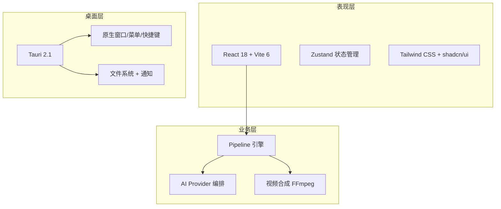

# 架构设计

> Story Weaver 的分层架构与设计决策

## 系统架构



## 分层架构

```
┌─────────────────────────────────────────────────────┐
│                   features/ (UI)                      │
│   漫剧创作界面 / 步骤导航 / 结果展示                    │
├─────────────────────────────────────────────────────┤
│                    core/ (业务)                       │
│   Pipeline 引擎 / AI Provider / 视频处理               │
├─────────────────────────────────────────────────────┤
│                   shared/ (基础)                      │
│   UI 组件 / 工具函数 / 类型定义 / 常量                  │
└─────────────────────────────────────────────────────┘
```

**依赖方向**: features → core → shared（单向，无反向）

## 技术栈

| 层   | 技术                   | 版本     |
| ---- | ---------------------- | -------- |
| 前端 | React + TypeScript     | 19 + 5.9 |
| 构建 | Vite                   | 6        |
| CSS  | Tailwind CSS           | 4        |
| 桌面 | Tauri                  | 2.1      |
| 后端 | Rust + FFmpeg          | 最新     |
| 测试 | Jest + Testing Library | 30+      |
| 状态 | Zustand                | 4        |

## 设计决策

### Symbol-keyed Pipeline 上下文

```typescript
export const CONTEXT_KEY: unique symbol = Symbol('PipelineContext');

export interface StepInput {
  [key: string]: unknown;
  [CONTEXT_KEY]?: PipelineContext; // 非枚举挂载，避免与步骤数据冲突
}
```

使用 Symbol 作为 Context 的挂载键，避免步骤返回值覆盖上下文。

### 双模 AI Provider

```typescript
export abstract class BaseAIProviderStrategy {
  abstract readonly name: string;
  abstract call(apiKey: string, config: AIRequestConfig): Promise<AIResponse>;
}

// OpenAI 兼容协议（OpenAI/Alibaba/Zhipu）
export abstract class OpenAICompatibleStrategy extends BaseAIProviderStrategy { ... }
```

7 Provider 共享同一接口，OpenAI 兼容协议封装为抽象基类消除重复。

[下一步：模块系统 →](/developer-guide/module-system)
