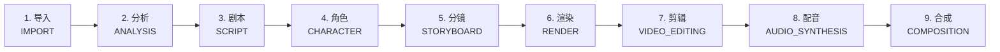

# 工作流概览

> Story Weaver 的 9 步端到端创作流水线

## 双模式对比

| 维度             | Autonomous Mode               | Manual Mode            |
| ---------------- | ----------------------------- | ---------------------- |
| **用户操作**     | 提供原材料 → 按「开始」→ 等待 | 逐步审批 / 编辑 / 调整 |
| **AI 行为**      | 自主分析 → 生成 → 审核 → 修复 | 按指令执行             |
| **Quality Gate** | 每步自动评分（fail 触发重试） | 仅提示，人工把关       |
| **Self-Review**  | 失败自动重试（≤3 次）         | 不重试                 |
| **断点续传**     | 30s 自动 Checkpoint           | 不支持                 |
| **适合场景**     | 批量生产、快速成片            | 精细定制               |
| **预估时间**     | 15-30 min（短篇）             | 数小时                 |

## 9 步流水线



## 质量保障

### Quality Gate（每步评分）

每一步输出都经过自动评分：

| 维度       | 阈值   | 说明             |
| ---------- | ------ | ---------------- |
| 角色一致性 | ≥ 0.85 | VLM 比对角色外观 |
| 视觉质量   | ≥ 0.80 | 构图/光影合理性  |
| 脚本对齐   | ≥ 0.90 | 与原始剧本吻合度 |
| 完整性     | 100%   | 必填字段不缺     |

### Self-Review Loop

审核失败时自动重试：

```
[Step N 输出] → QualityGate 判定
                       │
              ┌────────┴────────┐
              │                 │
            PASS              FAIL
              │                 │
              ▼           触发 Self-Review
          下一 步              │
                                ▼
                          优化 Prompt
                          重新执行 Step N
                          （最多 3 次）
```

::: tip Checkpoint
Autonomous 模式每 30 秒自动保存状态到本地。应用崩溃 → 重启后自动恢复；断网 → 重连后继续。
:::

[下一步：Autonomous 模式详解 →](/user-guide/autonomous-mode)
